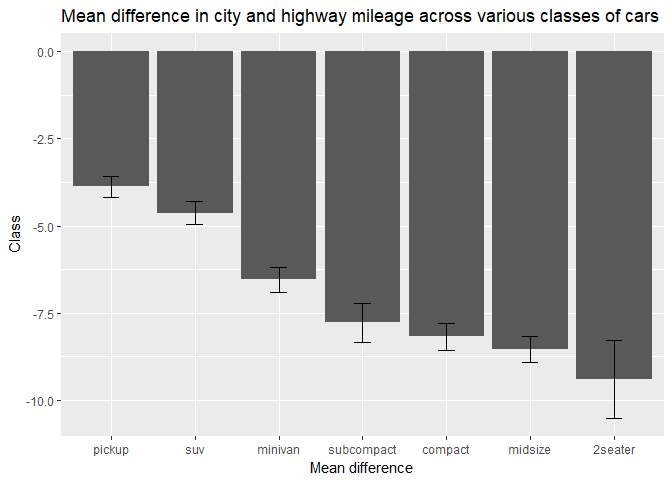
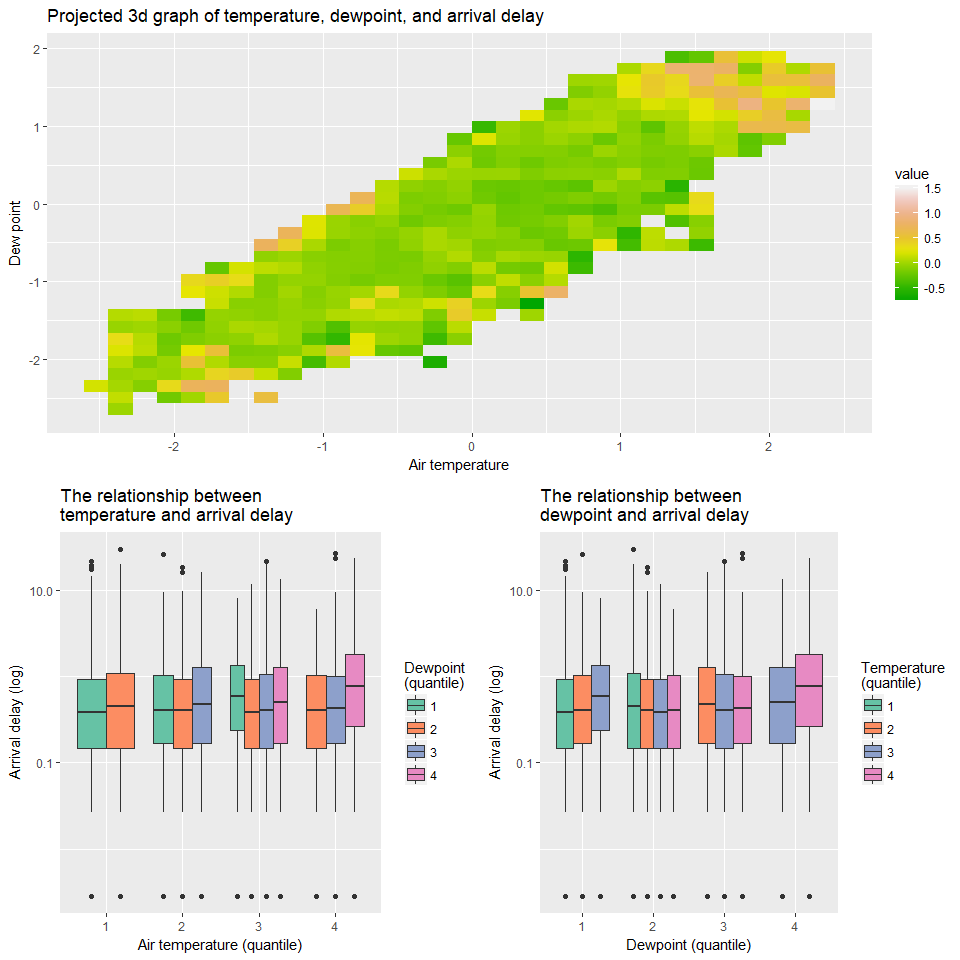

Exercises 8
================
Daria Kharkina (1670072)

Paired samples t-test
---------------------

Perform a paired samples t-test on city and highway mileage (from the mpg data frame) twice: one time using the jmv package, and one time using R's default t.test function.

``` r
library(tidyverse)
library(broom)
library(jmv)
library(qwraps2)
library(nycflights13)

options(list(digits=3, scipen=999))


fit1 <- t.test(mpg$cty, mpg$hwy, paired = T) %>% tidy %>%
  mutate(effsize = effsize::cohen.d(mpg$cty, mpg$hwy, paired = T)$estimate)


fit2 <- ttestPS(data = mpg, 
                   pairs = list(list(i1="cty",i2="hwy")), 
                   effectSize = TRUE)$ttest %>% as_tibble()

names(fit2) <- str_sub(names(fit2), end = -7)
```

### 1.1

Report the results of each approach in an RMarkdown sentence without hard-coding the numbers (so the numbers should be filled in by R when you render or preview the RMarkdown document). Include the descriptives (means and sd's) of city and highway mileage in the report and the effect size for the t-test. Don't worry if the end result of the two approaches is the same.

**t.test**

A paired-samples t-test was conducted to compare means for city and highway fuel consumption. There was a significant difference in mileage for city (*M* = `mean(mpg$cty, na.rm=T)`, *SD* = `sd(mpg$cty, na.rm=T)`) and highway (*M* = `mean(mpg$hwy, na.rm=T)`, *SD* = `sd(mpg$hwy, na.rm=T)`); *t*(`fit1$parameter`) = `fit1$statistic`, \``frmtp(fit1$p.value, digit = 3, markup = "markdown", case = "lower")`, *Cohen's d* = `fit1$effsize`.

A paired-samples t-test was conducted to compare means for city and highway fuel consumption. There was a significant difference in mileage for city (*M* = 16.859, *SD* = 4.256) and highway (*M* = 23.44, *SD* = 5.955); *t*(233) = -44.492, *p* &lt; 0.001, *Cohen's d* = -2.909.

**jamovi**

A paired-samples t-test was conducted to compare means for city and highway fuel consumption. There was a significant difference in mileage for city (*M* = `mean(mpg$cty,na.rm=T)`,*SD* = `sd(mpg$cty, na.rm=T)`) and highway (*M* = `mean(mpg$hwy, na.rm=T)`, *SD* = `sd(mpg$hwy, na.rm = T)`); *t*(233) = `fit2$stat`, `frmtp(fit2$p, digit = 3, markup = "markdown", case = "lower")`, *Cohen's d* = `fit2$es`

A paired-samples t-test was conducted to compare means for city and highway fuel consumption. There was a significant difference in mileage for city (*M* = 16.859, *SD* = 4.256) and highway (*M* = 23.44, *SD* = 5.955); *t*(`fit2$df`) = -44.492, *p* &lt; 0.001, *Cohen's d* = -2.909

### 1.2

Discuss the pro's and cons of each approach

Since Jamovi has buttons with labels on them, it is not scary for people who have started learning programming recently. On the other hand, this friendly interface shows users the whole dataset which is crucial for people with poorly performing laptop. I am thinking about using Jamovi without its interface because it is just a good toolbox with classical methods of data analysis. Meanwhile, there is no perfect package for this purpose in base R. The way I calculated effect size is a typical example of why statistics in base R is sometimes complicated.

Multiple t-tests
----------------

### 2.1

Perform a paired samples t-test on city and highway mileage (from the mpg data frame) for each class using one single pipe (hint: make use of tidy() and do()). Can you do the same thing with the jamovi approach efficiently? If the answer is no, discuss at least two reasons.

``` r
t <- Sys.time()
ttests1 <- mpg %>% group_by(class) %>% 
  do(tidy(t.test(.$cty, .$hwy, paired = T)))
Sys.time() - t
```

    ## Time difference of 0.109 secs

``` r
t <- Sys.time()
ttests2 <- data.frame()
for(i in unique(mpg$class)){
  ttests2 <- rbind(ttests2, ttestPS(data = filter(mpg, class == i),
                                    pairs = list(list(i1="cty",i2="hwy")),
                                    effectSize = TRUE)$ttest %>% as.data.frame())
}
Sys.time() - t
```

    ## Time difference of 0.913 secs

It is possible to do with Jamovi. However, I doubt that this approach is efficient. First, Jamovi is just a programme with precoded limited functionality while R is a full-fledged flexible programming language. The second reason is ...

### 2.2 - 2.3

Use the resulting tibble from the analysis in the previous question to create a bar graph displaying the estimated difference for each class (use the estimate column). Don't forget to add labels.

Add confidence intervals (using the conf.low and conf.high columns) as error bars to the bar graph (read the help on geom\_errorbar for more information).

``` r
ggplot(ttests1, aes(reorder(class, - estimate), estimate)) + geom_bar(stat = "identity") +
  geom_errorbar(aes(ymin = conf.low, ymax = conf.high), width = .2) +
  ggtitle("Mean difference in city and highway mileage across various classes of cars") +
  xlab("Mean difference") + 
  ylab("Class")
```



2.4.Create an additional column in the tibble with Bonferroni corrected p values of the t-tests (i.e., multiply every p value with the total number of t-tests computed). Don't forget to first cancel the grouping using ungroup() before mutating the new column if you plan to use n() as multiplier.

``` r
ttests1 <- ttests1 %>% ungroup %>% mutate(pBonferroni = p.value*n())
```

Regression and ANOVA
--------------------

### 3.1

Using the weather data set from the nycflights13 package, compare the average wind speed at JFK and Newark (EWR) airports with an independent samples t-test.

``` r
weather_jfk_ewr <- filter(weather, origin %in% c("JFK", "EWR"))

fit <- t.test(wind_speed ~ origin, data = weather_jfk_ewr) %>% tidy %>%
  mutate(effsize = effsize::cohen.d(wind_speed ~ origin, data = weather_jfk_ewr)$estimate)
```

An independent samples t-test was conducted to compare average wind speed at JFK and Newark airports. There was a significant difference in average wind speed at JFK (*M* = `mean(filter(weather, origin == "JFK")$wind_speed, na.rm=T)`,*SD* = `sd(filter(weather, origin == "JFK")$wind_speed, na.rm=T)`) and at Newark *M* = `mean(filter(weather, origin == "EWR")$wind_speed, na.rm=T)`,*SD* = `sd(filter(weather, origin == "EWR")$wind_speed, na.rm=T)`); *t*(`fit$parameter`) = `fit$statistic`, `frmtp(fit$p.value, digit = 3, markup = "markdown", case = "lower")`, *Cohen's d* = `fit$effsize`.

An independent samples t-test was conducted to compare average wind speed at JFK and Newark airports. There was a significant difference in average wind speed at JFK (*M* = 11.356,*SD* = 5.876) and at Newark *M* = 9.334,*SD* = 12.332); *t*(12465.032) = -13.808, *p* &lt; 0.001, *Cohen's d* = -0.209.

### 3.2

Perform a linear regression to see which weather indicators (without interactions) from the weather dataset predict departure delay in the flights dataset. Output a summary with standardised betas. What can you conclude? What are the three strongest predictors? How much variance is explained?

``` r
to_lm <- left_join(select(flights, year, month, day, time_hour, origin, arr_delay ), 
                   select(weather, -hour)) %>%
  select(-year, -month, -day, -time_hour, -origin) %>% na.omit() 
to_lm <-  lapply(to_lm, scale)

fit <- lm(arr_delay ~ ., data=to_lm) 

tidyfit <- tidy(fit)
names(tidyfit) <- c("*Variable*","*b*", "*SE*", "*t*", "*p*")
tidyfit$`*p*` <- frmtp(tidyfit$`*p*`, digit = 3, markup = "markdown", case = "lower") %>% 
  str_replace_all("\\*p\\* ", "") %>% str_replace_all("= ", "")
pander::pander(tidyfit, round=3)
```

<table style="width:57%;">
<colgroup>
<col width="18%" />
<col width="9%" />
<col width="9%" />
<col width="9%" />
<col width="9%" />
</colgroup>
<thead>
<tr class="header">
<th align="center"><em>Variable</em></th>
<th align="center"><em>b</em></th>
<th align="center"><em>SE</em></th>
<th align="center"><em>t</em></th>
<th align="center"><em>p</em></th>
</tr>
</thead>
<tbody>
<tr class="odd">
<td align="center">(Intercept)</td>
<td align="center">0</td>
<td align="center">0.002</td>
<td align="center">0</td>
<td align="center">1.000</td>
</tr>
<tr class="even">
<td align="center">temp</td>
<td align="center">-0.276</td>
<td align="center">0.021</td>
<td align="center">-13.22</td>
<td align="center">&lt; 0.001</td>
</tr>
<tr class="odd">
<td align="center">dewp</td>
<td align="center">0.362</td>
<td align="center">0.024</td>
<td align="center">15.18</td>
<td align="center">&lt; 0.001</td>
</tr>
<tr class="even">
<td align="center">humid</td>
<td align="center">-0.189</td>
<td align="center">0.011</td>
<td align="center">-16.9</td>
<td align="center">&lt; 0.001</td>
</tr>
<tr class="odd">
<td align="center">wind_dir</td>
<td align="center">-0.048</td>
<td align="center">0.002</td>
<td align="center">-23.24</td>
<td align="center">&lt; 0.001</td>
</tr>
<tr class="even">
<td align="center">wind_speed</td>
<td align="center">0.034</td>
<td align="center">0.002</td>
<td align="center">17.91</td>
<td align="center">&lt; 0.001</td>
</tr>
<tr class="odd">
<td align="center">precip</td>
<td align="center">0.039</td>
<td align="center">0.002</td>
<td align="center">19.73</td>
<td align="center">&lt; 0.001</td>
</tr>
<tr class="even">
<td align="center">pressure</td>
<td align="center">-0.102</td>
<td align="center">0.002</td>
<td align="center">-49.42</td>
<td align="center">&lt; 0.001</td>
</tr>
<tr class="odd">
<td align="center">visib</td>
<td align="center">-0.079</td>
<td align="center">0.002</td>
<td align="center">-33.71</td>
<td align="center">&lt; 0.001</td>
</tr>
</tbody>
</table>

Different weather indicators explained a significant proportion of variance in arrival delay, *R*<sup>2</sup> = `summary(fit)$adj.r.squared`, *F*(`summary(fit)$fstatistic[2]`, `summary(fit)$fstatistic[3]`) = `summary(fit)$fstatistic[1]`, `frmtp(stats::anova(lm(arr_delay ~ ., data=to_lm))$'Pr(>F)'[1], digit = 3, markup = "markdown", case = "lower")`

Different weather indicators explained a significant proportion of variance in arrival delay, *R*<sup>2</sup> = 0.024, *F*(8, 285696) = 891.043, *p* &lt; 0.001

Three strongest predictors are air temperature, dewpoint, relative humidity

### 3.3

Do the same analysis with a model that includes only the three strongest predictors from the previous analysis (look at the standardised betas), center them, and compute all interactions. Output an Type III Anova table. Are there a significant interactions? Which one?

``` r
vars <- (tidy(fit)%>% mutate(abs_b = abs(estimate)) %>% top_n(3,abs_b))$term

form <- as.formula(str_c("arr_delay ~ (", vars[1], "+", vars[2], "+", vars[3], ")^2"))
fit2 <- lm(form, data = to_lm)


tidyfit2 <- tidy(fit2)
names(tidyfit2) <- c("*Variable*","*b*", "*SE*", "*t*", "*p*")
tidyfit2$`*p*` <- frmtp(tidyfit2$`*p*`, digit = 3, markup = "markdown", case = "lower") %>% 
  str_replace_all("\\*p\\* ", "") %>% str_replace_all("= ", "")
pander::pander(tidyfit2, round=3)
```

<table style="width:57%;">
<colgroup>
<col width="18%" />
<col width="9%" />
<col width="9%" />
<col width="9%" />
<col width="9%" />
</colgroup>
<thead>
<tr class="header">
<th align="center"><em>Variable</em></th>
<th align="center"><em>b</em></th>
<th align="center"><em>SE</em></th>
<th align="center"><em>t</em></th>
<th align="center"><em>p</em></th>
</tr>
</thead>
<tbody>
<tr class="odd">
<td align="center">(Intercept)</td>
<td align="center">-0.096</td>
<td align="center">0.019</td>
<td align="center">-4.991</td>
<td align="center">&lt; 0.001</td>
</tr>
<tr class="even">
<td align="center">temp</td>
<td align="center">0.776</td>
<td align="center">0.254</td>
<td align="center">3.054</td>
<td align="center">0.002</td>
</tr>
<tr class="odd">
<td align="center">dewp</td>
<td align="center">-0.81</td>
<td align="center">0.287</td>
<td align="center">-2.823</td>
<td align="center">0.005</td>
</tr>
<tr class="even">
<td align="center">humid</td>
<td align="center">0.412</td>
<td align="center">0.126</td>
<td align="center">3.277</td>
<td align="center">0.001</td>
</tr>
<tr class="odd">
<td align="center">temp:dewp</td>
<td align="center">0.135</td>
<td align="center">0.002</td>
<td align="center">61.89</td>
<td align="center">&lt; 0.001</td>
</tr>
<tr class="even">
<td align="center">temp:humid</td>
<td align="center">0.036</td>
<td align="center">0.048</td>
<td align="center">0.747</td>
<td align="center">0.455</td>
</tr>
<tr class="odd">
<td align="center">dewp:humid</td>
<td align="center">-0.054</td>
<td align="center">0.044</td>
<td align="center">-1.243</td>
<td align="center">0.214</td>
</tr>
</tbody>
</table>

Temperature, dewpoint, relative humidity, and all interactions among them explained a significant proportion of variance in arrival delay, *R*<sup>2</sup> = `summary(fit2)$adj.r.squared`, *F*(`summary(fit2)$fstatistic[2]`, `summary(fit2)$fstatistic[3]`) = 932.046, `frmtp(stats::anova(lm(form, data=to_lm))$'Pr(>F)'[1], digit = 3, markup = "markdown", case = "lower")`. There is a significant interaction between temperature and dewpoint.

Temperature, dewpoint, relative humidity, and all interactions among them explained a significant proportion of variance in arrival delay, *R*<sup>2</sup> = 0.019, *F*(6, 285698) = 932.046, *p* &lt; 0.001. There is a significant interaction between temperature and dewpoint.

### 3.4

There should be one significant interaction in the previous analysis. Create one or more plot(s) to explore the interaction and describe what can be concluded.

Important HINT: If you want to split a continuous variable into several groups, you need to create that variable with a mutation command before plotting. If you just want to split into two groups based on the median, you can create a new variable holding true or false depending on whether the variable your splitting on is higher or lower than the median.

Another important HINT: If you want more than two groups (which I recommend) you needto bin your continuous variable into several groups. You can do this with the ntile() function which you can find on the dplyr cheatsheet. In a mutate, this function will create a new variable that contains the number of the group that the observation belongs to, with observations with higher values falling into higher group numbers. Note however, that because this new variable is still a number, ggplot will still consider it to be a continuous variable. To fix that, you will need to convert this number into a factor. This can be done in the same mutation command, e.g. with: `mutate(binnedvar = factor(ntile(originalvar)))`

``` r
df <- as.data.frame(to_lm) 
df <- df %>% mutate(temp_quartile  = factor(ntile(temp, 4)),
                    dewp_quartile = factor(ntile(dewp, 4)))

g1 <- ggplot(df, aes(temp, dewp, z = arr_delay)) + stat_summary_2d() +
  ggtitle("Projected 3d graph of temperature, dewpoint, and arrival delay") +
  xlab("Air temperature") + 
  ylab("Dew point") +
  scale_fill_gradientn(colours = terrain.colors(10)) 

g2 <- ggplot(df, aes(temp_quartile , arr_delay, fill=dewp_quartile)) +
  geom_boxplot() + scale_y_log10() + 
  ggtitle("The relationship between\ntemperature and arrival delay") +
  ylab("Arrival delay (log)") + xlab("Air temperature (quantile)") +
  guides(fill=guide_legend(title="Dewpoint\n(quantile)")) + 
  scale_fill_brewer(palette = "Set2") 

g3 <- ggplot(df, aes(dewp_quartile , arr_delay, fill=temp_quartile)) +
  geom_boxplot() + scale_y_log10() +
  ggtitle("The relationship between\ndewpoint and arrival delay")+
  ylab("Arrival delay (log)") + xlab("Dewpoint (quantile)") + 
  guides(fill=guide_legend(title="Temperature\n(quantile)")) + 
  scale_fill_brewer(palette = "Set2")

gridExtra::grid.arrange(g1, g2, g3, widths = c(1, 1), 
                        layout_matrix = rbind(c(1,1), c(2, 3)))
```

 Linear models are not the best choice for this data because the relationship between weather conditions and delay are non-linear. The first graph, however, sheds some ligth on this interaction. If both temperature and dewpoins have extremely low or high value, then longer delays occur

### 3.5

Perform an anova on arrival delays from the flights dataset with origin and destination as independent variables (without their interaction, this is not possible because the data are unbalanced) using the R-only approach and try the Jamovi approach. Depending on the speed of your computer, you will see that loading a large data set such as flights in Jamovi doesn't really work (for now). Conclude from that what you want and report the results for the R-only approach. Which of the two variables has the strongest effect on arrival delay?

``` r
options(contrasts = c('contr.sum','contr.poly'))

fit <- heplots::etasq(lm(arr_delay ~ origin + dest, data=flights), anova = T,type="III") %>%
  tidy()
```

A two-way ANOVA was run to examine the effect of origin and destination on arrival delay. The analysis revealed the significant effect of origin, *F*(`fit$df[fit$term == "origin"]`, `fit$df[fit$term == "Residuals"]`) = `fit$statistic[fit$term == "origin"]`, `frmtp(fit$p.value[fit$term == "origin"], digit = 3, markup = "markdown", case = "lower")`, *η*<sup>2</sup>*p* = `fit$Partial.eta.2[fit$term == "origin"]`. Moreover, the significant effect for destination has also been found, *F*(`fit$df[fit$term == "dest"]`, `fit$df[fit$term == "Residuals"]`) = `fit$statistic[fit$term == "dest"]`, `frmtp(fit$p.value[fit$term == "dest"], digit = 3, markup = "markdown", case = "lower")`, *η*<sup>2</sup>*p* = `fit$Partial.eta.2[fit$term == "dest"]`. Destination has the strongest effect on arrival delay

A two-way ANOVA was run to examine the effect of origin and destination on arrival delay. The analysis revealed the significant effect of origin, *F*(2, 327240) = 223.433, *p* &lt; 0.001, *η*<sup>2</sup>*p* = 0.001. Moreover, the significant effect for destination has also been found, *F*(103, 327240) = 36.673, *p* &lt; 0.001, *η*<sup>2</sup>*p* = 0.011. Destination has the strongest effect on arrival delay

### 3.6

Let's zoom in on the effect of origin on arrival delay in a regression. Use treatment contrast coding for the origin variable and describe the results based on the regression weights in RMarkdown, reporting the estimates and the p-values with in-line R code.

``` r
fit <- lm(arr_delay ~ origin, data = flights)
tidyfit <- tidy(fit)

tidyfit$term <- str_replace_all(tidyfit$term, "origin","")
names(tidyfit) <- c("*Variable*","*b*", "*SE*", "*t*", "*p*")
tidyfit$`*p*` <- frmtp(tidyfit$`*p*`, digit = 3, markup = "markdown", case = "lower") %>% 
  str_replace_all("\\*p\\* ", "") %>% str_replace_all("= ", "")

pander::pander(tidyfit, round = 3)
```

<table style="width:57%;">
<colgroup>
<col width="18%" />
<col width="9%" />
<col width="9%" />
<col width="9%" />
<col width="9%" />
</colgroup>
<thead>
<tr class="header">
<th align="center"><em>Variable</em></th>
<th align="center"><em>b</em></th>
<th align="center"><em>SE</em></th>
<th align="center"><em>t</em></th>
<th align="center"><em>p</em></th>
</tr>
</thead>
<tbody>
<tr class="odd">
<td align="center">(Intercept)</td>
<td align="center">6.814</td>
<td align="center">0.078</td>
<td align="center">87.25</td>
<td align="center">&lt; 0.001</td>
</tr>
<tr class="even">
<td align="center">1</td>
<td align="center">2.293</td>
<td align="center">0.108</td>
<td align="center">21.14</td>
<td align="center">&lt; 0.001</td>
</tr>
<tr class="odd">
<td align="center">2</td>
<td align="center">-1.263</td>
<td align="center">0.11</td>
<td align="center">-11.44</td>
<td align="center">&lt; 0.001</td>
</tr>
</tbody>
</table>

Origins explained a significant proportion of variance in arrival delay, *R*<sup>2</sup> = `summary(fit)$adj.r.squared`, *F*(`summary(fit)$fstatistic[2]`, `summary(fit)$fstatistic[3]`) = `summary(fit)$fstatistic[1]`, `frmtp(stats::anova(lm(arr_delay ~ origin, data=flights))$'Pr(>F)'[1], digit = 3, markup = "markdown", case = "lower")`. Since Newark is a reference category, an average delay in this airport equal the intercept. It was found that delays in JFK are smaller (*β* = `summary(fit)$coefficients[2,1]`, `frmtp(summary(fit)$coefficients[2,4], digit = 3, markup = "markdown", case = "lower")`). The same trend was observed for LGA (*β* = `summary(fit)$coefficients[3,1]`, `frmtp(summary(fit)$coefficients[3,4], digit = 3, markup = "markdown", case = "lower")`).

Origins explained a significant proportion of variance in arrival delay, *R*<sup>2</sup> = 0.001, *F*(2, 327343) = 224.934, *p* &lt; 0.001. Since Newark is a reference category, an average delay in this airport equal the intercept. It was found that delays in JFK are smaller (*β* = 2.293, *p* &lt; 0.001). The same trend was observed for LGA (*β* = -1.263, *p* &lt; 0.001).
